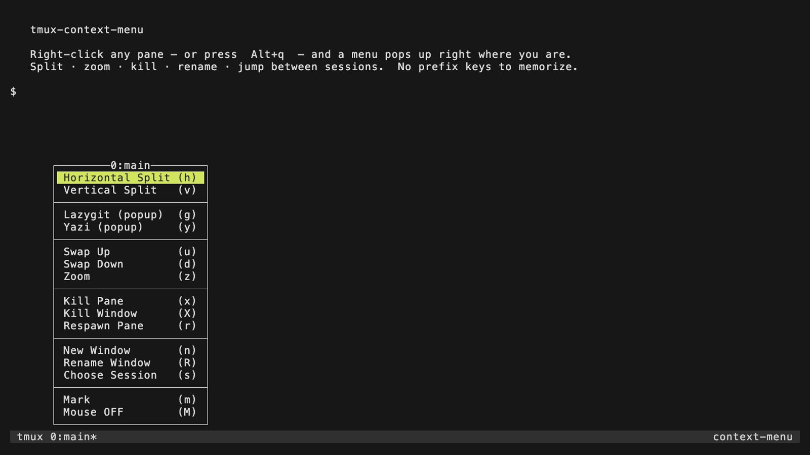
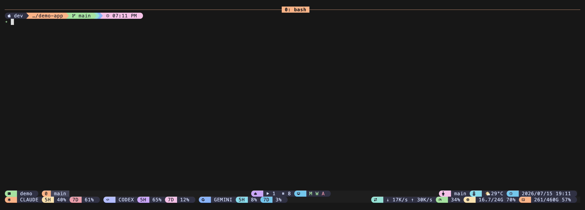
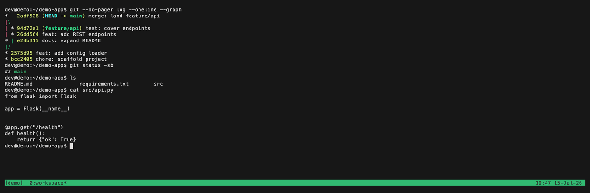

# tmux-context-menu

> 中文說明請見 [docs/zh.md](docs/zh.md)

**Right-click anywhere in a tmux pane and get a little menu — split, zoom, kill,
rename, jump between sessions — right where your mouse is.** No prefix keys to
memorize. Prefer the keyboard? The same menu opens with a hotkey (default
`Alt+q`).



*One keystroke (or a right-click) away: the whole menu, popped open right where you are — no prefix to memorize.*

---

## 1. What is this?

tmux normally hides its power behind a "prefix" key combo. This plugin puts the
most common actions on your **mouse right-click** instead: click, pick, done.
The menu pops up exactly where you clicked, so it feels like a normal desktop
app's right-click menu.

The core menu uses only tmux's own built-in commands. Optional entries — the
lazygit/yazi popups below, and anything you add via `@context-menu-extra` —
run external commands instead. If you happen to have
[lazygit](https://github.com/jesseduffield/lazygit) or
[yazi](https://github.com/sxyazi/yazi) installed, they show up as bonus
pop-up entries — automatically, and only if they're really there.

---

## 2. Quickstart

You need tmux (version 3.3a or newer — check with `tmux -V`).

**First, turn on tmux mouse mode.** It's off by default in released tmux, and
right-click can't pop the menu until it's on. Add this line to your
`~/.tmux.conf`:

```tmux
set -g mouse on
```

(The keyboard hotkey — default `Alt+q` — works without this, but the headline
right-click menu needs it.)

### If you use TPM (the Tmux Plugin Manager)

Most people who install tmux plugins use TPM. If you don't have it yet, this
one command installs it:

```sh
git clone https://github.com/tmux-plugins/tpm ~/.tmux/plugins/tpm
```

Then add these two lines to your `~/.tmux.conf` (near the bottom, but the
`run '~/.tmux/plugins/tpm/tpm'` line must stay last):

```tmux
set -g @plugin 'operonlab/tmux-context-menu'
run '~/.tmux/plugins/tpm/tpm'
```

Finally, reload tmux and install: press your prefix key (usually `Ctrl+b`),
then `I` (capital i). Done — right-click a pane.

### If you DON'T use TPM

Clone this repo anywhere, then add **one line** to your `~/.tmux.conf`:

```sh
git clone https://github.com/operonlab/tmux-context-menu ~/.tmux/plugins/tmux-context-menu
```

```tmux
run-shell '~/.tmux/plugins/tmux-context-menu/context-menu.tmux'
```

Reload your config (`tmux source-file ~/.tmux.conf`) and right-click a pane.

---

## 3. Demo



---

## 4. Options

Set any of these **above** the `run`/`run-shell` line in your `~/.tmux.conf`,
using `set -g`. All of them are optional — the defaults are sensible.

| Option | Default | What it does (plain words) |
|---|---|---|
| `@context-menu-mouse` | `on` | Turn the right-click menu on or off. `off` keeps only the keyboard hotkey. |
| `@context-menu-key` | `M-q` | The keyboard shortcut that opens the same menu. Set it to `''` (empty) to turn the hotkey off. Example: `set -g @context-menu-key 'M-e'`. |
| `@context-menu-disable-status-clicks` | `on` | Stops right-clicks on the status bar (the coloured strip at the bottom) from popping menus, so you don't trigger them by accident. |
| `@context-menu-mouse-copy` | `off` | Adds "double-click to select a word, triple-click to select a line, and copy — without scrolling away". It's off by default because it changes how clicks behave. |
| `@context-menu-copy-command` | `''` (empty) | Only matters when `@context-menu-mouse-copy` is `on`. Leave empty to copy into tmux's own clipboard. Set it to a command (e.g. `pbcopy` on macOS, `xclip -sel clip` on Linux) to also copy to your system clipboard. |
| `@context-menu-extra` | `''` (empty) | Add your own menu items. See the warning below. |
| `@context-menu-source` | `''` (empty) | Point it at a file that prints the **whole** menu, one record per line, and it **replaces** the built-in list with yours (`@context-menu-extra` still appends after it). The file is read — and run — every time the menu opens. See "Single-source menu items" below, including the ⚠️ warning: this **executes the file**. |

### Adding your own menu items (`@context-menu-extra`)

> ⚠️ **This option runs the commands you put in it.** Only set it in a
> `~/.tmux.conf` that you control and trust. Do not paste `@context-menu-extra`
> values from strangers or untrusted snippets — whatever you write here will be
> executed by tmux when the menu item is clicked.

Format: `label|key|command`, and you can add several items separated by `;`.

```tmux
set -g @context-menu-extra "Htop|H|display-popup -E htop ; Reload tmux|Q|source-file ~/.tmux.conf"
```

That adds two rows to the bottom of the menu: one opens `htop` in a pop-up
(press `H`), one reloads your tmux config (press `Q`).

### Single-source menu items (`@context-menu-source`)

`@context-menu-extra` *appends* a few rows. `@context-menu-source` goes further:
it lets **one file define the entire core menu**, replacing the built-in list.
Point the option at that file:

```tmux
set -g @context-menu-source '~/.tmux/menu-items.sh'
```

> ⚠️ **This option runs the file.** Every time the menu opens, the file is
> executed and its output parsed; any per-item `when` condition (below) is run
> through `sh -c`. Same trust model as `@context-menu-extra` — only ever point
> it at a file you wrote and control. Never use a file from an untrusted source.

**Replace vs. append.** When `@context-menu-source` is set and the file is
readable, its records become the whole core menu (the built-in Split / Zoom /
Kill / … list is *not* used). `@context-menu-extra` still runs afterwards, so
its items append to the bottom of your sourced list. Leave `@context-menu-source`
unset and nothing changes — the built-in menu behaves exactly as before.

**Record format.** The file prints one record per line. Fields are joined by the
ASCII **Unit Separator** byte `0x1F` — *not* tab or space. This matters: tab and
space are whitespace, and the shell's `read` collapses runs of them and drops
empty interior fields, so an empty `when`/`minver` would let `desc` slide into
the wrong column. `0x1F` is non-whitespace and never appears in real text, so
empty fields keep their position. The file stays newline-terminated and
greppable.

An **item** record has exactly seven fields:

```
type␟label␟key␟command␟when␟minver␟desc        (␟ = the 0x1F byte)
```

| field | meaning |
|---|---|
| `type` | literal `item`. |
| `label` | the menu label. May contain tmux `#{...}` format conditionals — passed to `display-menu` verbatim, so tmux evaluates them live at render time. |
| `key` | the mnemonic (a single character or key spec). |
| `command` | the tmux command run on click, exactly as `display-menu` should receive it (author it with ordinary single-quote shell quoting). |
| `when` | *(optional)* a shell condition; run via `sh -c`. Non-zero exit → the item is left out when the menu is built. Empty → always included. |
| `minver` | *(optional)* minimum tmux `MAJOR.MINOR`. If the running tmux is older, the item is left out. Empty → no version gate. |
| `desc` | *(optional)* human cheatsheet text; ignored by the menu itself. |

A line whose only field is the literal `sep` renders as a divider. Blank lines,
lines beginning with `#`, and items missing a label or key are skipped.

Authoring is easiest with two helpers at the top of the file:

```sh
US=$(printf '\037')
item() { printf '%s%s%s%s%s%s%s%s%s%s%s%s%s\n' item "$US" "$1" "$US" "$2" "$US" "$3" "$US" "${4-}" "$US" "${5-}" "$US" "${6-}"; }
sep()  { printf 'sep\n'; }

# usage: item <label> <key> <command> [when] [minver] [desc] ; sep
item 'Kill Pane' x 'kill-pane' '' '' 'close this pane'
item '#{?window_zoomed_flag,Unzoom,Zoom}' z 'resize-pane -Z' '' '' 'zoom toggle'
item 'Customize Options' c 'customize-mode -Z' '' '3.2' 'needs tmux 3.2'
sep
```

---

## 5. Uninstall

To remove every binding and option this plugin added from your **running** tmux,
without restarting:

```sh
tmux run-shell '~/.tmux/plugins/tmux-context-menu/scripts/teardown.sh'
```

Then delete the two lines you added to `~/.tmux.conf` (and, if you used TPM, the
`@plugin` line). See the FAQ about restoring tmux's original right-click menus.

---

## 6. Troubleshooting / FAQ

**I right-click and nothing happens.**
Mouse support has to be on in tmux. Add `set -g mouse on` to your `~/.tmux.conf`
and reload. (You can also toggle it from this plugin's menu via the keyboard
hotkey → "Mouse ON".)

**The `Alt+q` hotkey does nothing.**
Some terminals send `Alt` as an "escape" prefix, or already use `Alt+q`. Pick a
different key with `set -g @context-menu-key 'M-e'` (or any key), reload, and try
that instead. Set it to `''` to disable the hotkey entirely.

**After uninstalling, my status-bar right-click / drag-to-copy behaves oddly.**
`teardown.sh` removes what this plugin added, but tmux has no way to "undo back
to the previous binding". Where the plugin replaced a tmux built-in (status-bar
right-clicks, or drag-to-copy when the copy module was on), the built-in isn't
automatically restored. Just reload your config or restart the tmux server
(`tmux kill-server`) and tmux's defaults come back.

**Lazygit / Yazi don't appear in my menu.**
They only appear if the `lazygit` / `yazi` commands are found on your `PATH` when
the plugin loads. Install them (or fix your `PATH`), then reload tmux.

**Double-click to select a word doesn't work.**
That's the optional copy module — it's off by default. Turn it on with
`set -g @context-menu-mouse-copy on` and reload.

---

<!-- family-section -->
---

## Part of the [operonlab](https://github.com/operonlab) tmux family

Small, focused plugins that compose into one cockpit. Bare tmux **before**, the
family **after**:



Mix and match whichever you like:

| plugin | what it adds |
|--------|--------------|
| [tmux-workdesk](https://github.com/operonlab/tmux-workdesk) | one-key IDE + tile/main pane layouts |
| [tmux-floatpane](https://github.com/operonlab/tmux-floatpane) | a pop-up floating scratch terminal |
| **tmux-context-menu** — you are here | a right-click / prefix menu of pane actions |
| [tmux-autosize](https://github.com/operonlab/tmux-autosize) | auto-resize background windows to the client |
| [tmux-passthrough](https://github.com/operonlab/tmux-passthrough) | pass a key straight through to the inner app |
| [tmux-sysmon](https://github.com/operonlab/tmux-sysmon) | live CPU / MEM / DISK / NET capsules |
| [tmux-llm-usage](https://github.com/operonlab/tmux-llm-usage) | LLM quota / spend as a status capsule |
| [tmux-agent-status](https://github.com/operonlab/tmux-agent-status) | busy / blocked / idle AI-pane capsule |
| [tmux-pillbar](https://github.com/operonlab/tmux-pillbar) | build a second status row of custom pills |
| [tmux-agent-resume](https://github.com/operonlab/tmux-agent-resume) | replay each AI CLI to its exact session after a crash |

## 7. Credits

Prior art: [jaclu/tmux-menus](https://github.com/jaclu/tmux-menus) takes a
prefix-key **menu tree** approach and is excellent for full keyboard navigation.
tmux-context-menu is deliberately narrower: a **right-click-where-you-are**
workflow built around the mouse (with a keyboard hotkey as a peer entry point).

**Compatibility.** Tested on tmux `next-3.8` on macOS. The features this plugin
relies on — `display-menu` with mouse-relative positioning (`-x M -y M`) and
format-conditional menu items (`#{?...}`) — are documented as available since
**tmux 3.3a**, which is the stated minimum. (3.3a itself was not re-tested on the
build machine; it is the inherited/documented floor.)

## License

[MIT](LICENSE).